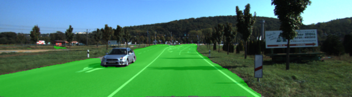

# Semantic Segmentation
## Objective
The objective of this project is to Label each pixel of a road in images using a Fully Convolutional Network (FCN). It is a binary classification problem in which the two classes are road/not-road

## File structure
1- The Ipython notebook "Semantic Segmenation.ipynb" contians all the project code.

2- The file helper.py contains some helper functions such as data generators

3- The file project_tests.py contains some tests to ensure the code is working correctly

## Setup
##### Frameworks and Packages
 - [Python 3](https://www.python.org/)
 - [TensorFlow](https://www.tensorflow.org/)
 - [NumPy](http://www.numpy.org/)
 - [SciPy](https://www.scipy.org/)
 
##### Dataset
The [Kitti Road dataset](http://www.cvlibs.net/datasets/kitti/eval_road.php) was used for this project

## Methodolgy
The Semantic Segmentation task can be solved using an encoder-decoder network. I used a Fully Convolutional Network (FCN-8) with skip connections as described in [Fully Convolutional Networks for Semantic Segmentation](https://people.eecs.berkeley.edu/~jonlong/long_shelhamer_fcn.pdf)

1- **The encoder:**  I used a pre-trained VGG16 network as an encoder, and replaced the fully connected layers by 1x1 convolutions to preserve the spatial features.

2- **The decoder:** The decoder is basically upsampling the output of the encoder by 2X2X8 to obtain an output with the same size as the original input image(160,576)

3- **Skip connections:** Skip connections were made to connect output of some shallow layers with deep layers, this skip connections helps the network to make local predictions that respect global structure and details. Layers 3, 4 and 7 of VGG16 (pooling layers) were used for skip connections 

4- **Optimization:** I used an Adam optimizer to minimize a binary cross entropy loss function

5- **Hyperparameters:** 

* Learning rate: I used a learning rate of 1e-4
* Dropout: A Keep probability of 0.5 was used
* Epochs: A number of 50 epochs was chosen manually based on the convergence of training loss 
* Batch size: A batch was manually chosen to be 5 images based on memory requirements and speed of convergence
* standard deviation of weights gaussian init: A std of 0.01 was chosen and it performed well and fastened the convergance.

## Results

Here are the results of the model on different scenes

